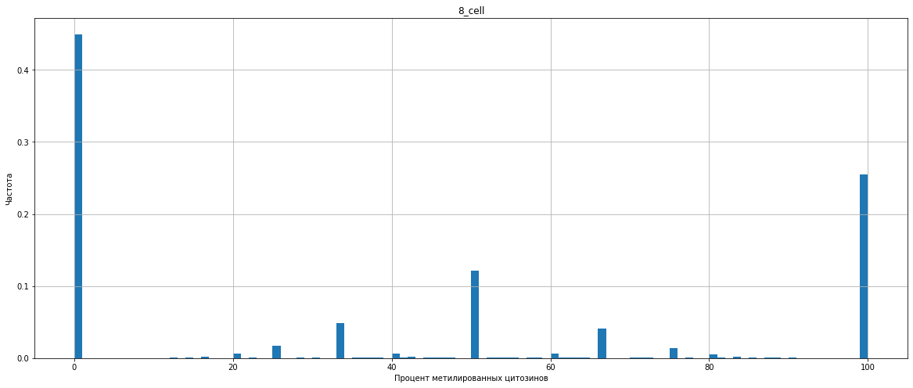
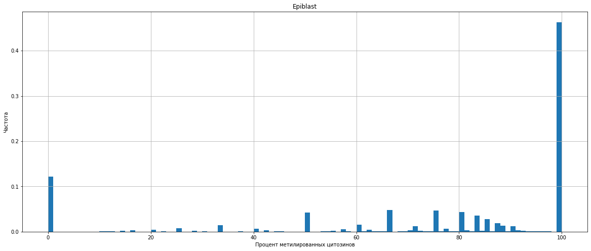

# hse_hw1_meth

## Colab
https://github.com/dabardonov/hse_hw1_meth/blob/main/HW1_meth.ipynb

## Сравнение отчетов FastQC для бисульфитного секвенирования и РНК

| Параметр | Бисульфитное секвенирование | РНК | Комментарий |
| ------------- | ------------- |--------------------| ----- |
|Per base sequence content|    |     | В РНК содержание всех нуклеотидов примерно одинаковое, тогда как в BS-seq заметно больше тимин и заметно меньше цитозина (что не удивительно, учитывая трансформацию неметилированных цитозинов в тимин в ходе BS-seq) |
| Per sequence GC content |   |  | Содержание GC в BS-seq заметно отличается от нормального (хотя бы наличием двух пиков); в РНК примерно в два раза больше GC   |

## Количество ридов и степень дедупликации

| Стадия развития\Регион | 11347700-11367700 | 40185800-40195800 | Степень дедупликации |
| ------------- | ------------- |--------------------| ----- |
| 8_cell | 1090 | 464 | 81.69% |
| Epiblast | 2328 | 1062 | 97.08% |
| ICM | 1456 | 630 | 90.92% |

## M-bias plots

| Стадия развития| Скриншот 1 | Скриншот 2 | Комментарий |
| ------------- | ------------- |--------------------| ----- |
| 8_cell |  |  | |
| ICM |  |  | |
| Epiblast |  |  | |

## Распределение метилирования цитозинов

| Стадия развития| Гистограмма |
| ------------- | ------------- |
| 8_cell |  |
| ICM |  |
| Epiblast |  |

Вывод: на стадии 8_cell доли неметилированных и полностью метилированных цитозинов примерно равны, на стадии ICM большинство цитозинов совсем не метилированы, на стадии Epiblast большая часть цитозинов 100% метилированы. Эти результаты сходятся с полученными из M-bias plots/

